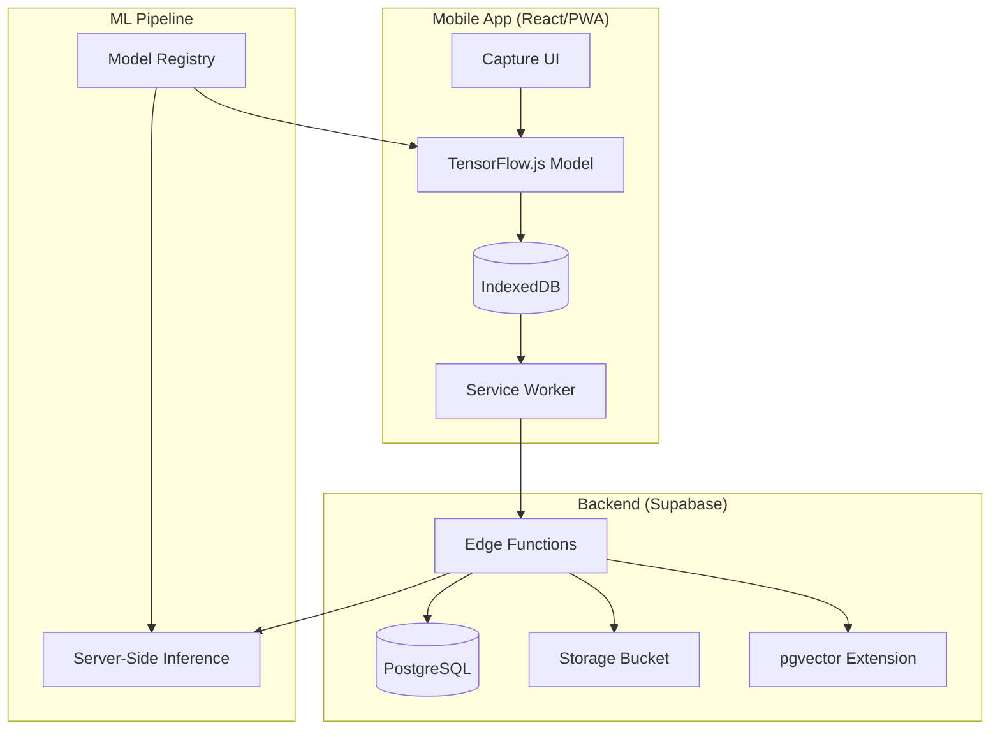
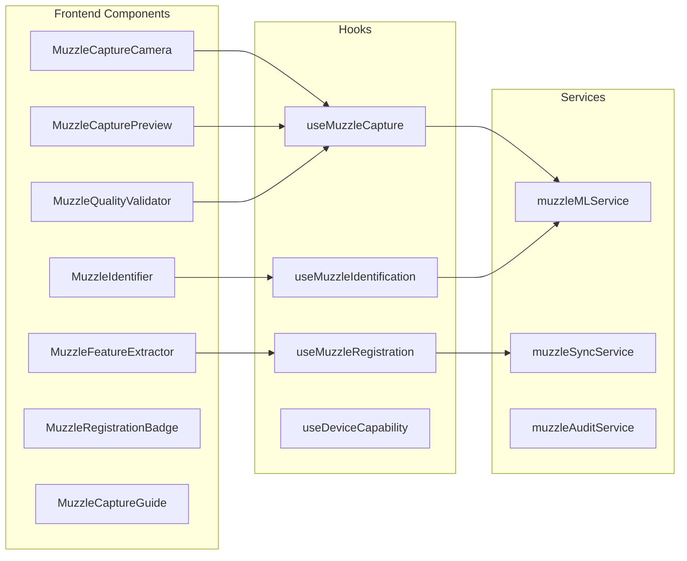
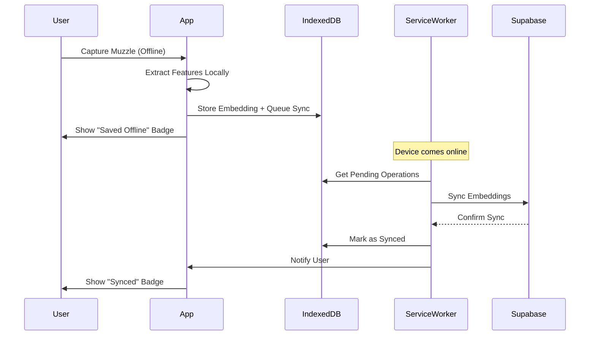
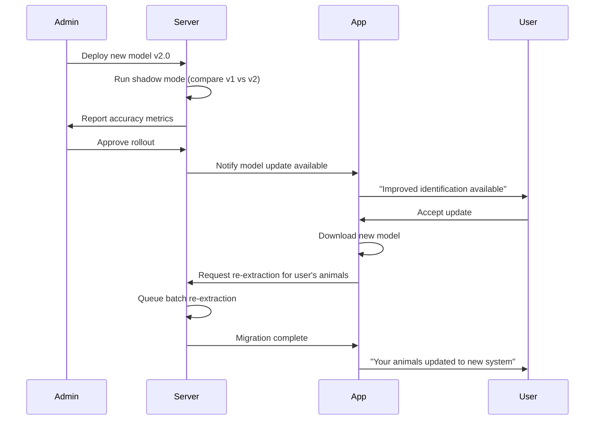

# Muzzle Identification System - Design Document

## Overview

This document outlines the technical design for implementing cattle muzzle/nose biometric identification in the MyLivestock app. The system enables farmers to register and identify animals using their unique muzzle prints, similar to human fingerprints.

### Key Design Goals
1. **Offline-First**: Works without internet in rural Ethiopian areas
2. **Low-End Device Support**: Runs on basic Android phones (2GB RAM)
3. **Fraud Prevention**: Prevents duplicate registrations and verifies ownership
4. **Bilingual**: Full Amharic and English support
5. **Progressive Enhancement**: Better experience on capable devices

## Architecture

### High-Level System Architecture



### Component Architecture



## Open Source Tool Selection

### Recommended ML Stack

| Component | Tool | Rationale |
|-----------|------|-----------|
| Client-Side Inference | **TensorFlow.js** | Best WebGL support, works offline, large community |
| Base Model | **MobileNetV3** | Optimized for mobile, good accuracy/speed tradeoff |
| Feature Extraction | **Custom CNN** | Fine-tuned on cattle muzzle dataset |
| Vector Search | **pgvector** | Native PostgreSQL extension, works with Supabase |
| Image Processing | **OpenCV.js** | Preprocessing, quality assessment |
| Fallback Inference | **ONNX Runtime** | Broader device compatibility |

### Why TensorFlow.js + MobileNetV3?

1. **Offline Capability**: Model runs entirely in browser
2. **WebGL Acceleration**: Uses GPU when available
3. **Small Model Size**: ~5MB quantized model
4. **Proven Track Record**: Used in similar livestock ID projects (India, Brazil)
5. **Active Development**: Regular updates and security patches

### Alternative Considered: MediaPipe
- Pros: Google-backed, excellent face detection
- Cons: Not optimized for animal muzzles, larger bundle size
- Decision: Use TensorFlow.js with custom model

## Components and Interfaces

### 1. MuzzleCaptureCamera Component

```typescript
interface MuzzleCaptureProps {
  onCapture: (images: CapturedImage[]) => void;
  onCancel: () => void;
  mode: 'registration' | 'identification';
  burstCount?: number; // Default: 3
}

interface CapturedImage {
  id: string;
  blob: Blob;
  dataUrl: string;
  timestamp: number;
  metadata: ImageMetadata;
}

interface ImageMetadata {
  width: number;
  height: number;
  brightness: number;
  blur: number;
  distance: 'too_close' | 'optimal' | 'too_far';
  lighting: 'poor' | 'acceptable' | 'good';
  motion: boolean;
}
```

### 2. MuzzleFeatureExtractor Service

```typescript
interface MuzzleFeatureExtractor {
  // Initialize ML model
  initialize(): Promise<void>;
  
  // Check if model is loaded
  isReady(): boolean;
  
  // Extract features from image
  extractFeatures(image: CapturedImage): Promise<MuzzleEmbedding>;
  
  // Get model info
  getModelInfo(): ModelInfo;
}

interface MuzzleEmbedding {
  id: string;
  vector: Float32Array; // 512-dimensional embedding
  confidence: number;
  modelVersion: string;
  extractedAt: string;
  imageQuality: QualityScore;
  captureConditions: CaptureConditions;
}

interface QualityScore {
  overall: number; // 0-100
  brightness: number;
  sharpness: number;
  coverage: number; // How much of muzzle is visible
}

interface CaptureConditions {
  lighting: string;
  distance: string;
  motion: boolean;
  deviceType: string;
}
```

### 3. MuzzleIdentifier Service

```typescript
interface MuzzleIdentifier {
  // Search for matching animal
  identify(embedding: MuzzleEmbedding): Promise<IdentificationResult>;
  
  // Search local database first
  identifyOffline(embedding: MuzzleEmbedding): Promise<IdentificationResult>;
  
  // Queue for cloud search when online
  queueCloudSearch(embedding: MuzzleEmbedding): Promise<void>;
}

interface IdentificationResult {
  status: 'match' | 'possible_match' | 'no_match' | 'error';
  confidence: number;
  animal?: AnimalMatch;
  alternatives?: AnimalMatch[]; // For possible matches
  searchedLocal: boolean;
  searchedCloud: boolean;
  timestamp: string;
}

interface AnimalMatch {
  animalId: string;
  animalCode: string;
  name: string;
  type: string;
  breed: string;
  ownerId: string;
  ownerName: string;
  ownerPhone?: string;
  similarity: number;
  muzzleRegisteredAt: string;
}
```

### 4. Device Capability Handler

```typescript
interface DeviceCapability {
  canRunMLLocally: boolean;
  hasWebGL: boolean;
  estimatedRAM: number;
  gpuTier: 'low' | 'medium' | 'high';
  recommendedMode: 'local' | 'server' | 'lite';
  batteryLevel?: number;
  isLowPowerMode: boolean;
}

interface UseDeviceCapabilityReturn {
  capability: DeviceCapability;
  isAssessing: boolean;
  reassess: () => Promise<void>;
  inferenceMode: 'local' | 'server';
  setInferenceMode: (mode: 'local' | 'server') => void;
}
```

### 5. Ownership Transfer Interface

```typescript
interface OwnershipTransfer {
  id: string;
  animalId: string;
  fromUserId: string;
  toUserId: string;
  status: 'pending' | 'confirmed' | 'disputed' | 'completed' | 'cancelled';
  initiatedAt: string;
  confirmedAt?: string;
  completedAt?: string;
  muzzleVerified: boolean;
  verificationAttempts: number;
}

interface TransferService {
  initiateTransfer(animalId: string, toUserId: string): Promise<OwnershipTransfer>;
  confirmTransfer(transferId: string, pin: string): Promise<void>;
  verifyMuzzle(transferId: string, embedding: MuzzleEmbedding): Promise<boolean>;
  disputeTransfer(transferId: string, reason: string): Promise<void>;
  completeTransfer(transferId: string): Promise<void>;
}
```

## Data Models

### Database Schema (Supabase/PostgreSQL)

```sql
-- Enable pgvector extension for similarity search
CREATE EXTENSION IF NOT EXISTS vector;

-- Muzzle registrations table
CREATE TABLE muzzle_registrations (
  id UUID PRIMARY KEY DEFAULT gen_random_uuid(),
  animal_id UUID NOT NULL REFERENCES animals(id) ON DELETE CASCADE,
  user_id UUID NOT NULL,
  
  -- Embedding data
  embedding vector(512) NOT NULL,
  embedding_version VARCHAR(20) NOT NULL DEFAULT '1.0.0',
  
  -- Image reference
  image_url TEXT,
  thumbnail_url TEXT,
  
  -- Quality metadata
  quality_score INTEGER CHECK (quality_score >= 0 AND quality_score <= 100),
  capture_conditions JSONB,
  
  -- Audit fields
  created_at TIMESTAMPTZ DEFAULT NOW(),
  updated_at TIMESTAMPTZ DEFAULT NOW(),
  is_active BOOLEAN DEFAULT true,
  
  -- Consent tracking
  consent_given BOOLEAN DEFAULT false,
  consent_timestamp TIMESTAMPTZ,
  
  UNIQUE(animal_id) -- One muzzle per animal
);

-- Index for vector similarity search
CREATE INDEX ON muzzle_registrations 
  USING ivfflat (embedding vector_cosine_ops)
  WITH (lists = 100);

-- Muzzle identification attempts (audit log)
CREATE TABLE muzzle_identification_logs (
  id UUID PRIMARY KEY DEFAULT gen_random_uuid(),
  user_id UUID NOT NULL,
  
  -- Search details
  search_embedding vector(512),
  search_mode VARCHAR(20) NOT NULL, -- 'local', 'cloud', 'hybrid'
  
  -- Results
  result_status VARCHAR(20) NOT NULL, -- 'match', 'possible_match', 'no_match'
  matched_animal_id UUID REFERENCES animals(id),
  confidence_score DECIMAL(5,4),
  alternatives JSONB, -- Array of possible matches
  
  -- Context
  device_info JSONB,
  location_info JSONB,
  
  created_at TIMESTAMPTZ DEFAULT NOW()
);

-- Duplicate detection events
CREATE TABLE muzzle_duplicate_events (
  id UUID PRIMARY KEY DEFAULT gen_random_uuid(),
  
  -- The new registration attempt
  attempted_animal_id UUID,
  attempted_user_id UUID NOT NULL,
  attempted_embedding vector(512),
  
  -- The existing match
  existing_registration_id UUID REFERENCES muzzle_registrations(id),
  existing_animal_id UUID REFERENCES animals(id),
  existing_user_id UUID,
  
  -- Similarity
  similarity_score DECIMAL(5,4) NOT NULL,
  
  -- Resolution
  resolution VARCHAR(30), -- 'continued', 'transfer_requested', 'fraud_reported', 'cancelled'
  resolution_notes TEXT,
  resolved_at TIMESTAMPTZ,
  resolved_by UUID,
  
  created_at TIMESTAMPTZ DEFAULT NOW()
);

-- Ownership transfers with muzzle verification
CREATE TABLE ownership_transfers (
  id UUID PRIMARY KEY DEFAULT gen_random_uuid(),
  animal_id UUID NOT NULL REFERENCES animals(id),
  
  from_user_id UUID NOT NULL,
  to_user_id UUID NOT NULL,
  
  status VARCHAR(20) NOT NULL DEFAULT 'pending',
  -- 'pending', 'awaiting_verification', 'verified', 'disputed', 'completed', 'cancelled'
  
  -- Muzzle verification
  muzzle_verified BOOLEAN DEFAULT false,
  verification_attempts INTEGER DEFAULT 0,
  last_verification_at TIMESTAMPTZ,
  verification_confidence DECIMAL(5,4),
  
  -- Timestamps
  initiated_at TIMESTAMPTZ DEFAULT NOW(),
  confirmed_at TIMESTAMPTZ,
  completed_at TIMESTAMPTZ,
  
  -- Dispute handling
  dispute_reason TEXT,
  dispute_resolved_at TIMESTAMPTZ,
  
  CONSTRAINT valid_transfer CHECK (from_user_id != to_user_id)
);

-- Model version tracking
CREATE TABLE muzzle_model_versions (
  id UUID PRIMARY KEY DEFAULT gen_random_uuid(),
  version VARCHAR(20) NOT NULL UNIQUE,
  model_url TEXT NOT NULL,
  model_size_bytes INTEGER,
  embedding_dimension INTEGER DEFAULT 512,
  accuracy_score DECIMAL(5,4),
  is_active BOOLEAN DEFAULT false,
  released_at TIMESTAMPTZ DEFAULT NOW(),
  deprecated_at TIMESTAMPTZ,
  notes TEXT
);
```

### IndexedDB Schema (Offline Storage)

```typescript
interface MuzzleOfflineDB {
  // Cached ML model
  models: {
    key: string; // 'muzzle-model-v1.0.0'
    data: ArrayBuffer;
    version: string;
    downloadedAt: number;
    size: number;
  };
  
  // Local muzzle registrations for offline matching
  localMuzzles: {
    id: string;
    animalId: string;
    embedding: Float32Array;
    animalName: string;
    animalType: string;
    ownerName: string;
    syncedAt: number;
  };
  
  // Pending operations queue
  pendingOperations: {
    id: string;
    type: 'registration' | 'identification' | 'update';
    data: any;
    createdAt: number;
    retryCount: number;
  };
  
  // Capture history for retry
  captureHistory: {
    id: string;
    images: Blob[];
    embedding?: Float32Array;
    status: 'pending' | 'processed' | 'failed';
    createdAt: number;
  };
}
```

## Error Handling

### Error Types and Recovery

```typescript
enum MuzzleErrorCode {
  // Capture errors
  CAMERA_ACCESS_DENIED = 'CAMERA_ACCESS_DENIED',
  CAMERA_NOT_AVAILABLE = 'CAMERA_NOT_AVAILABLE',
  IMAGE_QUALITY_TOO_LOW = 'IMAGE_QUALITY_TOO_LOW',
  
  // ML errors
  MODEL_LOAD_FAILED = 'MODEL_LOAD_FAILED',
  MODEL_NOT_CACHED = 'MODEL_NOT_CACHED',
  EXTRACTION_FAILED = 'EXTRACTION_FAILED',
  EXTRACTION_TIMEOUT = 'EXTRACTION_TIMEOUT',
  
  // Identification errors
  NO_MATCH_FOUND = 'NO_MATCH_FOUND',
  MULTIPLE_MATCHES = 'MULTIPLE_MATCHES',
  SEARCH_TIMEOUT = 'SEARCH_TIMEOUT',
  
  // Registration errors
  DUPLICATE_DETECTED = 'DUPLICATE_DETECTED',
  ANIMAL_ALREADY_REGISTERED = 'ANIMAL_ALREADY_REGISTERED',
  
  // Network errors
  OFFLINE_NO_LOCAL_DATA = 'OFFLINE_NO_LOCAL_DATA',
  SYNC_FAILED = 'SYNC_FAILED',
  
  // Device errors
  DEVICE_NOT_SUPPORTED = 'DEVICE_NOT_SUPPORTED',
  INSUFFICIENT_MEMORY = 'INSUFFICIENT_MEMORY',
}

interface MuzzleError {
  code: MuzzleErrorCode;
  message: string;
  messageAm: string; // Amharic translation
  recoveryAction?: RecoveryAction;
  retryable: boolean;
}

type RecoveryAction = 
  | { type: 'retry' }
  | { type: 'retake_photo'; guidance: string }
  | { type: 'enable_camera' }
  | { type: 'download_model' }
  | { type: 'use_server_fallback' }
  | { type: 'wait_for_connection' }
  | { type: 'contact_support' };
```

### Error Messages (Bilingual)

```typescript
const errorMessages: Record<MuzzleErrorCode, { en: string; am: string }> = {
  CAMERA_ACCESS_DENIED: {
    en: 'Camera access denied. Please enable camera in settings.',
    am: 'ካሜራ መጠቀም አልተፈቀደም። እባክዎ በቅንብሮች ውስጥ ካሜራን ያንቁ።'
  },
  IMAGE_QUALITY_TOO_LOW: {
    en: 'Image quality too low. Please try again with better lighting.',
    am: 'የምስል ጥራት በጣም ዝቅተኛ ነው። እባክዎ በተሻለ ብርሃን እንደገና ይሞክሩ።'
  },
  MODEL_NOT_CACHED: {
    en: 'Identification model not downloaded. Connect to internet to download.',
    am: 'የመለያ ሞዴል አልወረደም። ለማውረድ ከኢንተርኔት ጋር ይገናኙ።'
  },
  DUPLICATE_DETECTED: {
    en: 'This muzzle pattern may already be registered to another animal.',
    am: 'ይህ የአፍንጫ ንድፍ ቀድሞውኑ ለሌላ እንስሳ ተመዝግቦ ሊሆን ይችላል።'
  },
  // ... more error messages
};
```

## Testing Strategy

### Unit Tests

```typescript
// Test categories
describe('MuzzleFeatureExtractor', () => {
  it('should load model within 5 seconds');
  it('should extract 512-dimensional embedding');
  it('should handle low-quality images gracefully');
  it('should work offline with cached model');
});

describe('MuzzleIdentifier', () => {
  it('should find exact match with >90% confidence');
  it('should return possible matches for 70-90% confidence');
  it('should search local database when offline');
  it('should queue cloud search when offline');
});

describe('DeviceCapability', () => {
  it('should detect WebGL availability');
  it('should estimate device RAM');
  it('should recommend server fallback for low-end devices');
});
```

### Integration Tests

```typescript
describe('Muzzle Registration Flow', () => {
  it('should complete registration with valid muzzle image');
  it('should detect and handle duplicates');
  it('should sync to cloud when online');
  it('should work entirely offline');
});

describe('Muzzle Identification Flow', () => {
  it('should identify registered animal');
  it('should handle unregistered animal');
  it('should work with server fallback');
});
```

### E2E Tests

```typescript
describe('Muzzle Capture E2E', () => {
  it('should guide user through capture process');
  it('should show quality feedback in real-time');
  it('should handle burst capture mode');
});

describe('Ownership Transfer E2E', () => {
  it('should complete transfer with muzzle verification');
  it('should handle disputed transfers');
});
```

## Performance Considerations

### Model Optimization

| Optimization | Impact | Implementation |
|--------------|--------|----------------|
| Quantization | 4x smaller model | INT8 quantization |
| Pruning | 30% faster inference | Remove redundant weights |
| WebGL Backend | 10x faster on GPU | TensorFlow.js WebGL |
| Model Caching | Instant load after first | IndexedDB storage |

### Memory Management

```typescript
// Cleanup strategy for low-memory devices
const memoryManager = {
  // Release model when not in use
  releaseModel: () => {
    if (model) {
      model.dispose();
      model = null;
    }
  },
  
  // Clear image buffers after processing
  clearImageBuffers: () => {
    capturedImages.forEach(img => URL.revokeObjectURL(img.dataUrl));
    capturedImages = [];
  },
  
  // Monitor memory usage
  checkMemory: () => {
    if (navigator.deviceMemory && navigator.deviceMemory < 2) {
      return 'low';
    }
    return 'normal';
  }
};
```

### Offline Sync Strategy



## Security Considerations

### Data Protection

1. **Encryption at Rest**: Embeddings encrypted in IndexedDB using Web Crypto API
2. **Encryption in Transit**: All API calls over HTTPS
3. **Access Control**: RLS policies restrict muzzle data access to owners
4. **Audit Logging**: All identification attempts logged

### Privacy Compliance

```typescript
interface ConsentRecord {
  userId: string;
  animalId: string;
  consentType: 'biometric_collection' | 'data_sharing' | 'analytics';
  consentGiven: boolean;
  timestamp: string;
  ipAddress?: string;
  consentText: string; // The exact text user agreed to
}

// Consent must be obtained before muzzle capture
const requireConsent = async (userId: string, animalId: string): Promise<boolean> => {
  const existingConsent = await getConsent(userId, animalId);
  if (existingConsent?.consentGiven) return true;
  
  // Show consent dialog
  const userConsent = await showConsentDialog({
    title: t('muzzle.consent.title'),
    description: t('muzzle.consent.description'),
    dataUsage: t('muzzle.consent.dataUsage'),
  });
  
  if (userConsent) {
    await recordConsent(userId, animalId, 'biometric_collection', true);
  }
  
  return userConsent;
};
```

## UI/UX Design

### Capture Flow

```
┌─────────────────────────────────────┐
│  📷 Capture Muzzle                  │
│                                     │
│  ┌─────────────────────────────┐   │
│  │                             │   │
│  │    ○ ○ ○ ○ ○ ○ ○ ○ ○ ○    │   │
│  │    ○                   ○    │   │
│  │    ○   [Guide Circle]  ○    │   │
│  │    ○                   ○    │   │
│  │    ○ ○ ○ ○ ○ ○ ○ ○ ○ ○    │   │
│  │                             │   │
│  └─────────────────────────────┘   │
│                                     │
│  💡 Move closer for better detail   │
│                                     │
│  [━━━━━━━━━━━━━━━━━━━━━━━━━━━━━━]  │
│  Quality: ████████░░ 80%            │
│                                     │
│  [ Cancel ]        [ 📸 Capture ]   │
└─────────────────────────────────────┘
```

### Identification Result

```
┌─────────────────────────────────────┐
│  ✅ Animal Identified               │
│                                     │
│  ┌─────────┐                        │
│  │  🐄     │  Bossy                 │
│  │  Photo  │  Holstein Cow          │
│  └─────────┘  ID: FARM-COW-001      │
│                                     │
│  Confidence: 94%                    │
│  ━━━━━━━━━━━━━━━━━━━━━━━━━━━━━━━━  │
│                                     │
│  Owner: Abebe Kebede                │
│  Farm: Kebede Family Farm           │
│  Location: Debre Birhan             │
│                                     │
│  [ View Details ]  [ New Scan ]     │
└─────────────────────────────────────┘
```

## Model Training and Validation

### Training Data Strategy

```typescript
interface ModelTrainingPipeline {
  // Data collection strategy
  dataCollection: {
    sources: [
      'Ethiopian Agricultural Research Centers',
      'Partner farms in Oromia, Amhara, SNNPR regions',
      'Existing cattle ID research datasets (India, Brazil)',
      'User-contributed verified images'
    ];
    diversityMetrics: {
      breeds: ['Zebu', 'Holstein', 'Jersey', 'Boran', 'Horro', 'Fogera', 'Begait'];
      ageRanges: ['calf (0-6mo)', 'young (6-18mo)', 'adult (18mo+)'];
      regions: ['Highland', 'Lowland', 'Mixed farming'];
      lightingConditions: ['bright sun', 'shade', 'overcast', 'indoor'];
    };
    minDatasetSize: 10000; // Images
    validationSplit: 0.2; // 20% for validation
  };
  
  // Model validation metrics
  validationMetrics: {
    accuracy: 0.95; // Target >95%
    falsePositiveRate: 0.01; // Target <1%
    falseNegativeRate: 0.02; // Target <2%
    crossBreedAccuracy: 0.93; // Performance across different breeds
  };
  
  // Continuous improvement
  feedbackLoop: {
    userCorrectionMechanism: 'Report incorrect match button';
    modelRetrainingFrequency: 'Quarterly with new data';
    aBTestingStrategy: 'Shadow mode for new models before rollout';
  };
}
```

### Data Augmentation

```typescript
const augmentationPipeline = {
  // Geometric transformations
  geometric: {
    rotation: { range: [-15, 15], probability: 0.5 },
    scale: { range: [0.9, 1.1], probability: 0.3 },
    flip: { horizontal: true, probability: 0.5 },
  },
  
  // Photometric transformations (simulate Ethiopian conditions)
  photometric: {
    brightness: { range: [-0.2, 0.2], probability: 0.5 },
    contrast: { range: [0.8, 1.2], probability: 0.3 },
    saturation: { range: [0.8, 1.2], probability: 0.3 },
    noise: { type: 'gaussian', stddev: 0.02, probability: 0.2 },
  },
  
  // Simulate real-world conditions
  realWorld: {
    blur: { kernel: [3, 5], probability: 0.2 }, // Motion blur
    occlusion: { maxPercent: 0.1, probability: 0.1 }, // Partial coverage
    dust: { intensity: 0.1, probability: 0.15 }, // Dusty conditions
  }
};
```

## Edge Case Handling

### Special Conditions

```typescript
interface EdgeCaseHandling {
  // Special conditions
  specialConditions: {
    injuredMuzzle: {
      detection: 'ML model trained to detect scars, wounds, abnormalities';
      handling: 'Flag for manual review, request additional angles';
      tagging: 'injury_detected flag with severity score';
      fallback: 'Use ear tag + body markings for verification';
    };
    youngAnimal: {
      ageThreshold: 6; // Months before muzzle pattern stabilizes
      reRegistrationPolicy: 'Recommend re-capture at 6 months';
      growthTracking: true;
      confidenceAdjustment: 'Lower threshold to 85% for calves';
    };
    partialMuzzle: {
      minVisiblePercentage: 70;
      confidenceAdjustment: 'Reduce confidence proportionally';
      userGuidance: 'Show overlay indicating missing areas';
      reconstructionAttempt: true; // Try to match with partial data
    };
    twins: {
      detection: 'Flag when similarity > 85% between different animals';
      handling: 'Request additional distinguishing features';
      verification: 'Side-by-side comparison mode';
    };
  };
  
  // Fallback identification methods
  fallbackMethods: {
    earTagRecognition: true; // OCR on ear tags
    bodyMarkings: true; // Color patterns, spots
    locationHistory: true; // GPS + time correlation
    ownerVerification: true; // PIN/OTP confirmation
    photoComparison: true; // Side-by-side manual comparison
  };
}
```

### Stress Detection and Animal Welfare

```typescript
interface AnimalWelfareProtocol {
  // Stress indicators
  stressDetection: {
    indicators: [
      'Excessive movement detected',
      'Multiple failed capture attempts',
      'Time threshold exceeded (>2 minutes)',
    ];
    response: {
      showCalmingTips: true;
      suggestBreak: true;
      offerReschedule: true;
    };
  };
  
  // Capture guidelines
  captureGuidelines: {
    approachMethod: 'Calm, slow approach from side';
    flashUsage: 'Never use flash - startles animals';
    restraintRequired: false;
    maxAttempts: 5;
    cooldownPeriod: 30; // Seconds between attempts
  };
  
  // Welfare tips (shown in UI)
  welfareTips: {
    en: [
      'Approach the animal calmly from the side',
      'Avoid sudden movements',
      'Let the animal sniff your hand first',
      'Take a break if the animal seems stressed',
    ];
    am: [
      'እንስሳውን በእርጋታ ከጎን ይቅረቡ',
      'ድንገተኛ እንቅስቃሴዎችን ያስወግዱ',
      'እንስሳው መጀመሪያ እጅዎን እንዲሸት ይፍቀዱ',
      'እንስሳው የተጨነቀ ከመሰለ እረፍት ይውሰዱ',
    ];
  };
}
```

## User Onboarding and Training

### Training Modules

```typescript
interface UserOnboarding {
  // Training modules
  trainingModules: {
    captureTechnique: {
      videoTutorials: true; // 30-second videos in Amharic/English
      interactiveGuide: true; // Step-by-step overlay
      practiceMode: true; // Practice with sample images
      gamification: true; // Badges for successful captures
    };
    troubleshooting: {
      commonIssues: [
        'Image too dark',
        'Animal moving',
        'Muzzle not centered',
        'Distance too far',
        'Glare on muzzle',
      ];
      guidedSolutions: true;
      supportContact: 'In-app chat + phone number';
    };
  };
  
  // First-time experience
  firstTimeExperience: {
    guidedRegistration: true;
    sampleAnimals: true; // Practice with demo animals
    proficiencyAssessment: true; // Quiz after tutorial
    skipOption: true; // Allow experienced users to skip
  };
  
  // Ongoing education
  ongoingEducation: {
    tipsRotation: true; // Show different tips each session
    bestPracticeReminders: true; // After failed attempts
    seasonalGuidance: true; // Lighting tips for rainy/dry season
    successCelebration: true; // Positive feedback on good captures
  };
}
```

### Tutorial Flow

```
┌─────────────────────────────────────┐
│  🎓 Learn Muzzle Capture            │
│                                     │
│  Step 1 of 4                        │
│  ━━━━━━━━━━━━━━━━━━━━━━━━━━━━━━━━  │
│                                     │
│  ┌─────────────────────────────┐   │
│  │                             │   │
│  │   [Video: Approaching       │   │
│  │    animal calmly]           │   │
│  │                             │   │
│  └─────────────────────────────┘   │
│                                     │
│  💡 Approach from the side,         │
│     not directly in front           │
│                                     │
│  [ Skip Tutorial ]    [ Next → ]    │
└─────────────────────────────────────┘
```

## Model Versioning and Migration

### Version Management

```typescript
interface ModelVersioningStrategy {
  // Version management
  versionManagement: {
    semanticVersioning: true; // MAJOR.MINOR.PATCH
    compatibilityMatrix: {
      // Which client versions work with which embedding versions
      '1.0.x': ['embedding-v1'],
      '1.1.x': ['embedding-v1', 'embedding-v2'],
      '2.0.x': ['embedding-v2', 'embedding-v3'],
    };
    deprecationPolicy: {
      noticePeriod: 90; // Days warning before deprecation
      supportWindow: 180; // Days of support after deprecation notice
      forcedUpgradeThreshold: 3; // Major versions behind
    };
  };
  
  // Migration strategy
  migrationStrategy: {
    automaticReExtraction: true; // Background re-extraction when model updates
    batchProcessing: true; // Process in batches to avoid overload
    userNotification: true; // Notify when migration complete
    fallbackToOldModel: true; // Keep old model for comparison
    prioritization: 'active_animals_first'; // Migrate frequently-used animals first
  };
  
  // Performance tracking
  performanceTracking: {
    accuracyComparison: true; // A/B test new vs old model
    speedComparison: true;
    userFeedback: true; // Track correction rates
    rollbackTriggers: [
      'accuracy_drop > 5%',
      'false_positive_rate > 2%',
      'user_complaints > threshold',
    ];
  };
}
```

### Migration Process



## Data Retention and Governance

### Retention Policies

```typescript
interface DataGovernance {
  // Retention policies
  retentionPolicies: {
    biometricData: {
      retentionPeriod: 7; // Years (typical livestock lifespan)
      archivePolicy: 'Move to cold storage after 2 years inactive';
      deletionProcess: 'Secure deletion with audit log';
      ownershipTransfer: 'Data follows animal ownership';
    };
    identificationLogs: {
      retentionPeriod: 24; // Months
      anonymizationProcess: 'Remove user PII after 6 months';
      aggregationPolicy: 'Aggregate for analytics after anonymization';
    };
    auditLogs: {
      retentionPeriod: 7; // Years (legal requirement)
      complianceRequirements: ['Ethiopian data protection laws'];
      immutability: true; // Cannot be modified after creation
    };
    capturedImages: {
      retentionPeriod: 30; // Days (only keep embeddings long-term)
      compressionPolicy: 'Thumbnail only after extraction';
    };
  };
  
  // Data ownership
  dataOwnership: {
    farmerRights: [
      'View all data associated with their animals',
      'Export data in standard format',
      'Request deletion (with ownership verification)',
      'Transfer data with animal sale',
    ];
    dataPortability: true; // Export in JSON/CSV format
    deletionProcess: 'Complete within 7 days of verified request';
    consentWithdrawal: 'Immediate stop of new collection, 30-day deletion';
  };
  
  // Compliance
  compliance: {
    regulations: [
      'Ethiopian Data Protection Proclamation',
      'Agricultural data sharing guidelines',
    ];
    certificationRequirements: ['Annual security audit'];
    auditFrequency: 'Quarterly internal, Annual external';
    reportingObligations: ['Annual transparency report'];
  };
}
```

## Scalability Considerations

### Performance Targets

```typescript
interface ScalabilityPlan {
  // Performance targets
  performanceTargets: {
    concurrentUsers: 10000; // Peak concurrent users
    animalsPerFarmer: 100; // Average herd size
    totalAnimals: 1000000; // 1M animals in system
    identificationLatency: 3000; // 95th percentile ms
    searchLatency: 1000; // 95th percentile ms
    storageGrowth: 500; // GB per year
  };
  
  // Scaling strategy
  scalingStrategy: {
    databaseSharding: false; // Not needed initially, pgvector handles well
    readReplicas: true; // For search queries
    cdnUsage: true; // Model files and thumbnails
    edgeComputing: false; // Future consideration
    vectorIndexPartitioning: true; // By region for faster local search
  };
  
  // Monitoring
  monitoring: {
    keyMetrics: [
      'identification_latency_p95',
      'extraction_success_rate',
      'model_load_time',
      'offline_queue_size',
      'sync_failure_rate',
    ];
    alertThresholds: {
      latency_p95: 5000, // ms
      error_rate: 0.05, // 5%
      queue_size: 1000, // items
    };
    capacityPlanning: 'Monthly review of growth trends';
    performanceRegressionTests: true;
  };
}
```

## Accessibility Features

### Accommodations

```typescript
interface AccessibilityFeatures {
  // Visual accommodations
  visualAccommodations: {
    highContrastMode: true; // For outdoor use in bright sun
    textToSpeech: true; // Read instructions aloud
    adjustableTextSize: true; // Large text option
    colorBlindSupport: true; // Avoid red/green only indicators
    hapticFeedback: true; // Vibration for capture confirmation
  };
  
  // Motor accommodations
  motorAccommodations: {
    voiceCommands: true; // "Capture" voice trigger
    simplifiedCapture: true; // Auto-capture when quality is good
    gestureControl: false; // Not practical for this use case
    largeButtons: true; // Easy to tap with work gloves
  };
  
  // Cognitive accommodations
  cognitiveAccommodations: {
    simplifiedMode: true; // Fewer options, guided flow
    progressiveDisclosure: true; // Show advanced options only when needed
    contextualHelp: true; // Help button on every screen
    multiLanguageSupport: true; // Amharic, English, Oromiffa (future)
    iconWithText: true; // Never icons alone
  };
  
  // Rural-specific accommodations
  ruralAccommodations: {
    lowBandwidthMode: true; // Minimal data usage
    offlineFirst: true; // Works without internet
    batteryOptimization: true; // Reduce processing when battery low
    sunlightReadable: true; // High contrast for outdoor use
  };
}
```

## Disaster Recovery

### Backup Strategy

```typescript
interface DisasterRecovery {
  // Backup strategy
  backupStrategy: {
    biometricData: {
      frequency: 'Daily incremental, Weekly full';
      retention: '90 days of backups';
      location: 'Geographically distributed (AWS regions)';
      encryption: 'AES-256 at rest';
    };
    modelFiles: {
      frequency: 'On each release';
      retention: 'All versions indefinitely';
      location: 'CDN with origin backup';
    };
  };
  
  // Recovery procedures
  recoveryProcedures: {
    dataCorruption: {
      detection: 'Automated integrity checks';
      recovery: 'Point-in-time recovery from backup';
      rto: 4; // Hours - Recovery Time Objective
      rpo: 24; // Hours - Recovery Point Objective
    };
    serviceOutage: {
      detection: 'Health checks every 30 seconds';
      failover: 'Automatic to backup region';
      notification: 'SMS to on-call team';
    };
  };
  
  // Local device recovery
  localRecovery: {
    offlineDataSync: 'Automatic when connection restored';
    conflictResolution: 'Server wins with user notification';
    dataExport: 'Manual export option for users';
  };
}
```

## Implementation Phases

### Phase 1: Core Infrastructure (Week 1-2)
- Set up database schema with pgvector
- Implement basic capture UI with guide overlay
- Integrate TensorFlow.js with placeholder model
- Add device capability detection

### Phase 2: ML Integration (Week 3-4)
- Train/fine-tune muzzle recognition model on cattle dataset
- Implement feature extraction service
- Add quality validation with real-time feedback
- Implement burst capture with auto-selection

### Phase 3: Identification & Registration (Week 5-6)
- Implement vector similarity search with pgvector
- Add duplicate detection with resolution options
- Build registration flow integrated with animal registration
- Add muzzle verification badge

### Phase 4: Offline & Sync (Week 7-8)
- Implement IndexedDB storage for embeddings
- Add service worker sync with conflict resolution
- Handle offline queue with prioritization
- Add sync status indicators

### Phase 5: Ownership Transfer (Week 9)
- Build transfer flow with muzzle verification
- Add dispute handling mechanism
- Implement audit logging
- Add notification system for transfers

### Phase 6: Edge Cases & Welfare (Week 10)
- Implement injured muzzle detection
- Add young animal handling
- Build fallback identification methods
- Add animal welfare guidance

### Phase 7: User Training & Polish (Week 11)
- Create interactive tutorials (video + guided)
- Complete Amharic translations
- Add accessibility features
- Implement onboarding flow

### Phase 8: Testing & Optimization (Week 12)
- Performance optimization for low-end devices
- E2E testing across device types
- Security audit
- Beta testing with partner farms

